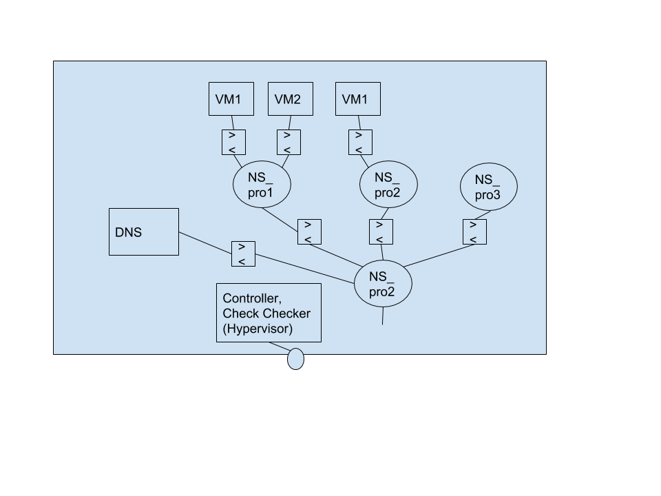

## Claim

- Project report
- code/scripts with readme

## Features

- HTTP/TCP
- Health check
- Autoscaling
- (optional) Monitoring and logging

## Logical flow

What happens when user create a new LB:

1. Controller create a VM ( get IP)
2. Configure LB function on that VM
3. Health checker machine register new VM
4. Register VM ip on DNS ( get URL)
5. Create a new namespace(subnet) if new project’
6. Return URL

How to monitor load?

1. Health checkers’ job ( using collectd framework)
2. Design data structure to store the monitor log

What happens when load increasing/decreasing ? (if auto-scaling)

increasing:

1. Health checker found it. 
2. Controller assigned a new VM
3. Repeat as above

What if one LB crash?

1. Health checker found it
2. Create a new one
3. Renew DNS
4. If old one keeps down
    1. For a period time? Delete it
5. If old one get healthy again
    1. Delete new one.

What if health checker down? Too evil to consider it.

## Architecture



Controller machine:
- process all incoming requests
- manipulate VMs and subnets

```python
class Controller:
    def __init__(self):
        """
        """
        self.projects = {}
    
    def add_project(self, user: string, project: Project):
        """ add a new project
        Parameters:
        user: user 
        project: project to be added
        """
        if self.projects.has_key(user):
            self.projects[user].append(project)
        else:
            self.proejcts[user] = [project]
    
    def remove_project(self, user, project: Project):
        """ remove a project
        """

    def update_info_all(self):
        """ update all projects status
        """

    def update_info(self, project: Project):
        """ read collected log to update the status
        """
```

```python
class Project:
    def __init__(self, id, name):
        self.id = id
        self.name = name
        self.subnet = Subnet()
        self.vms = []

    def init_subnet(self):
        """ create and initializa a network namespace
        """
        self.subnet.initialize()
    
    def add_vm(self, vm: VM):
        """ attach a new VM in the current project
        """
        self.subnet.add_vm(vm)
        self.vms.append(vm)

    def remove_vm(self, vm: VM):
        """ remove a VM from the current project
        """
        self.subnet.remove_vm(vm)
        self.vms.remove(vm)
```

```python
class Subnet:
    def __init__(self):
        self.name = ""
        self.id = -1

    def initializa(self):
        """ create a new network namespace
        """

    def add_vm(self, vm: VM):
        """ create a new L2 bridge and attach to the namespace
        """

    def remove_vm(self, vm: VM):
        """ detach and destroy corresponding bridge
        """
```

```python
_VMCONFIG = {
    "vcpu": 4,
    "disk_size": 10
}

class VM:
    def __init__(self):
        self.id = -1

    def create(self):
        """ create a new VM
        """

    def delete(self):
        """ delete it
        """

    def initializa(self):
        """ install packets, collected and configure
        """
    
    def add_backend(self, ip: string):
        """ add a backend server
        """
    
    def remove_backend(self, ip: string):
        """ remove a backend server
        """
    
    def update_backend(self, old_ip: string, new_ip: string):
        """ update a bacend server
        """
    
    def attach_to_subnet(self):
        """ attack to subnet
        """
```

## UI

Basically users communicate with our system in JSON formatted data. They send GET request containing JSON to our server, and get corresponding result. 

Here is the template of the request and response:

```json
{
    "action": ["create"/"info"/"update"/"delete"],
    "type": ["project"/"instance"],
    "info": {
        "name": "example"
    }
}
```

```json
{
    "status": ["successful"/"fail"],
    "action": "create",
    "type": "project",
    "info": {
        "name": "example",
        "id": 1,
    }
}
```

### Project

```json
{
    "type": "project",
    "user": "john",
    "name": "john's project",
    "instances": [],
}
```

### Instance

```json
{
    "type": "instance",
    "traffic_type": ["tcp"/"http"],
    "subnet": "1.1.1.0/24",
    "backend": {
        "entities": [
            ["ip"/"url"], ...
        ],
        "health-check": {},
        "auto-scaling": true,
    }
}
```

### health check

check the status of backend servers:

```json
{
    "protocol": ["HTTP"/"TCP"],
    "port": 80,
    "request-path": "/",
    "criteria": {
        "interval": 5,
        "timeout": 5,
        "health-threshold": 2,
        "unhealth-threshold": 2
    }
}
```